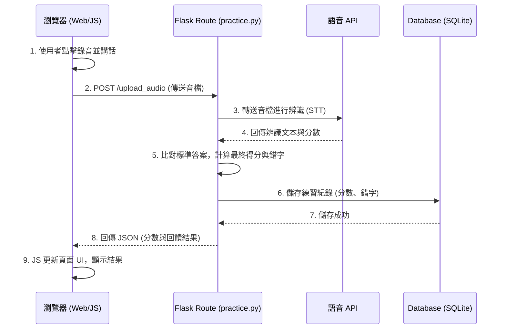

# 系統架構設計文件 (Architecture) - 英文口說練習系統

## 1. 技術架構說明

本專案採用傳統的伺服器端渲染 (Server-Side Rendering, SSR) 架構，以確保開發速度與結構的簡潔性，非常適合我們定義的 MVP 階段。

### 選用技術與原因
- **後端框架：Python + Flask**
  - 原因：輕量、靈活，適合快速打造 API 與處理語音檔案的上傳及呼叫第三方服務。
- **前端渲染：Jinja2 模板引擎 + HTML/CSS/Vanilla JS**
  - 原因：與 Flask 原生整合，不需要額外維護獨立的前端專案（如 React/Vue），降低學習與部署成本。前端 JS 僅負責呼叫瀏覽器原生 API 進行錄音與處理播放邏輯。
- **資料庫：SQLite (搭配 SQLAlchemy 或原生 sqlite3)**
  - 原因：無需架設獨立的資料庫伺服器，檔案型資料庫方便本地開發與備份，對於輕量級的學習紀錄系統已非常足夠。
- **語音處理：第三方 API (如 OpenAI Whisper 或 Google Speech-to-Text)**
  - 原因：自行訓練語音模型成本過高。串接成熟的 API 能提供精準的文本與信心度分數，用來實作「發音弱點分析」。

### Flask MVC 模式說明
專案邏輯將遵循 MVC (Model-View-Controller) 設計模式的概念：
- **Model (資料模型)**：負責定義資料結構（如 User, Record, Question）並與 SQLite 溝通。
- **View (視圖)**：Jinja2 模板與靜態資源，負責將 Controller 傳來的資料渲染成 HTML 並呈現給使用者。
- **Controller (控制器/路由)**：Flask 的 `@app.route`，負責接收使用者的 HTTP 請求、呼叫模型存取資料、串接語音 API，並將結果傳遞給 View 渲染。

---

## 2. 專案資料夾結構

建議採用以下模組化的結構，將不同職責的程式碼分開，保持專案整潔：

```text
web_app_development/
├── app/                      # 應用程式主目錄
│   ├── __init__.py           # Flask App 初始化與套件設定
│   ├── models/               # 資料庫模型 (Model)
│   │   ├── __init__.py
│   │   ├── user.py           # 使用者模型
│   │   ├── question.py       # 題目模型
│   │   └── record.py         # 練習紀錄模型
│   ├── routes/               # 路由與業務邏輯 (Controller)
│   │   ├── __init__.py
│   │   ├── main.py           # 首頁與一般頁面路由
│   │   ├── auth.py           # 註冊/登入路由
│   │   └── practice.py       # 測驗、錄音上傳與 API 串接路由
│   ├── templates/            # Jinja2 模板 (View)
│   │   ├── base.html         # 共用版型 (Header/Footer)
│   │   ├── index.html        # 首頁
│   │   ├── practice.html     # 錄音測驗頁面
│   │   └── dashboard.html    # 學習紀錄與弱點分析面板
│   └── static/               # 靜態資源
│       ├── css/
│       │   └── style.css     # 全域樣式表
│       ├── js/
│       │   └── recorder.js   # 處理瀏覽器錄音與音檔傳送的邏輯
│       └── audio/            # 系統預設的範例聲音檔
├── docs/                     # 專案設計文件 (PRD, 架構圖等)
├── instance/                 # 本地端特定檔案 (不進版控)
│   └── database.db           # SQLite 資料庫檔案
├── temp/                     # 暫存資料夾 (放置使用者上傳的錄音檔，處理完即刪)
├── app.py                    # 專案啟動入口點
├── requirements.txt          # Python 依賴套件清單
└── .gitignore                # Git 忽略清單 (需包含 instance/ 與 temp/)
```

---

## 3. 元件關係圖

以下展示使用者在「進行口說練習」時，系統各元件的資料流向：



---

## 4. 關鍵設計決策

1. **錄音處理於前端完成**
   - **決策**：使用瀏覽器的 Web Audio API 收集麥克風音訊，轉換成 Blob 格式後再上傳。
   - **原因**：減少伺服器的即時處理壓力。後端只負責接收最終的音檔進行後續處理。

2. **音檔不長期留存**
   - **決策**：使用者的錄音檔上傳至 `temp/` 目錄，在傳送給語音 API 並取得結果後，立即從伺服器刪除。
   - **原因**：節省伺服器儲存空間，同時確保使用者隱私安全。只需要將「判讀結果 (文本與分數)」存入資料庫即可。

3. **路由按功能模組化 (Blueprints)**
   - **決策**：不將所有路由寫在單一 `app.py` 中，而是透過 Flask Blueprint 分成 `main.py`, `auth.py`, `practice.py`。
   - **原因**：隨著專案變大，模組化能讓程式碼更易於維護與團隊協作。

4. **非同步的前後端溝通 (AJAX/Fetch)**
   - **決策**：在「錄音上傳與等候評分」這個步驟，前端使用 JavaScript `fetch` 非同步呼叫後端 API，而不是進行傳統的表單提交 (Form Submit) 換頁。
   - **原因**：語音辨識 API 可能需要 1~3 秒的時間，非同步請求可以在這段時間內於前端顯示載入動畫，提升使用者體驗。
