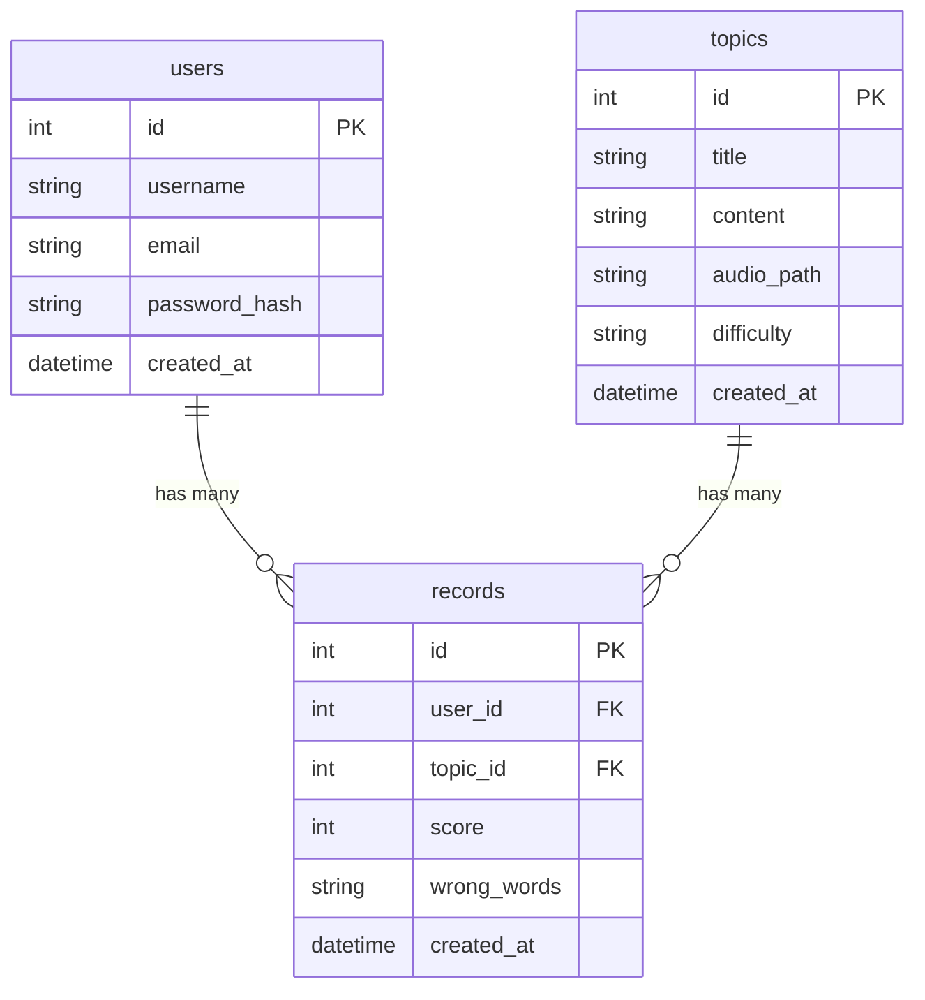

# 資料庫設計文件 (Database Design) - 英文口說練習系統

## 1. ER 圖 (實體關係圖)

## 2. 資料表詳細說明

### 2.1 users (使用者資料表)
儲存使用者的基本帳號資訊。
- `id` (INTEGER): 唯一識別碼，自動遞增 (Primary Key)。
- `username` (TEXT): 使用者顯示名稱，必填。
- `email` (TEXT): 登入用的 Email，必填且唯一。
- `password_hash` (TEXT): 加密過後的密碼，必填。
- `created_at` (DATETIME): 帳號建立時間。

### 2.2 topics (測驗題目資料表)
儲存系統提供的口說練習題目。
- `id` (INTEGER): 唯一識別碼，自動遞增 (Primary Key)。
- `title` (TEXT): 題目名稱或情境 (如: 餐廳點餐)，必填。
- `content` (TEXT): 實際要朗讀的英文句子或段落，必填。
- `audio_path` (TEXT): 標準發音音檔的相對路徑。
- `difficulty` (TEXT): 難易度分類 (如: Easy, Normal, Hard)。
- `created_at` (DATETIME): 題目建立時間。

### 2.3 records (練習紀錄資料表)
儲存每次使用者進行口說測驗的結果。
- `id` (INTEGER): 唯一識別碼，自動遞增 (Primary Key)。
- `user_id` (INTEGER): 關聯到使用者的 ID (Foreign Key)。
- `topic_id` (INTEGER): 關聯到題目的 ID (Foreign Key)。
- `score` (INTEGER): 系統評分 (0-100)。
- `wrong_words` (TEXT): JSON 格式的字串，儲存念錯的單字陣列 (例如 `["apple", "banana"]`)。
- `created_at` (DATETIME): 測驗完成時間。
