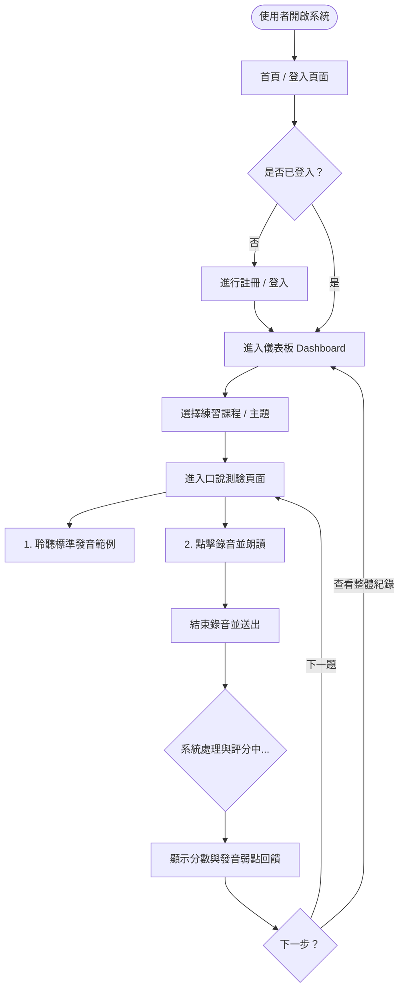
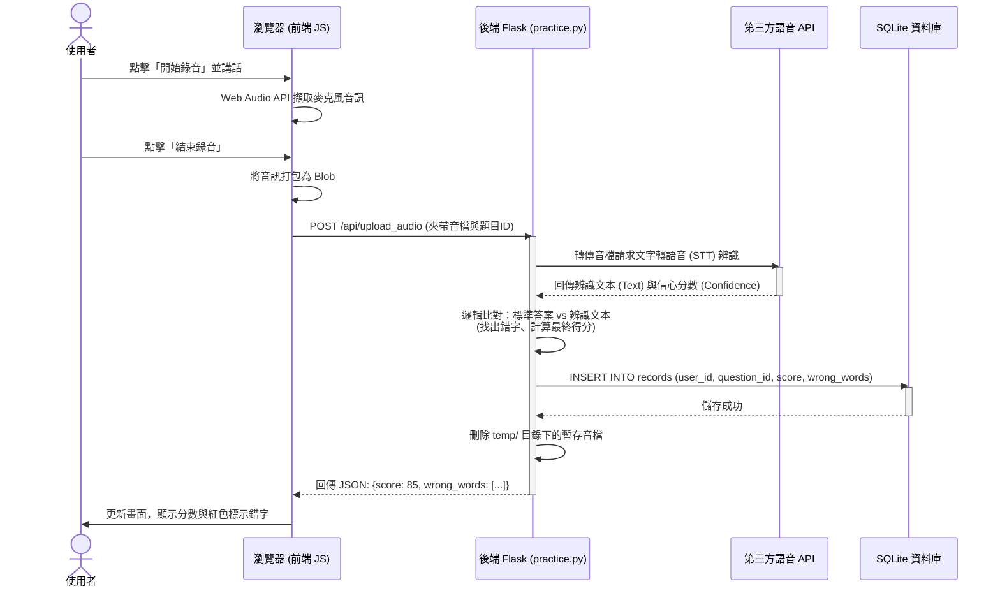

# 系統流程圖與操作路徑 (Flowchart) - 英文口說練習系統

## 1. 使用者流程圖 (User Flow)

這張圖展示了使用者進入系統後，從瀏覽題目、進行測驗到查看成績的完整操作路徑。

## 2. 系統序列圖 (Sequence Diagram)

這張圖詳細描述了核心功能：「使用者點擊錄音並送出」到「取得分數並存入資料庫」背後的系統互動流程。

## 3. 功能清單對照表

本表列出系統主要功能與其對應的 URL 路徑與 HTTP 方法，供後續 API 實作參考。

| 功能模組 | 操作描述 | HTTP 方法 | URL 路徑 | 對應的 Route 檔案 |
| :--- | :--- | :--- | :--- | :--- |
| **網頁載入** | 首頁 (歡迎畫面) | GET | `/` | `routes/main.py` |
| **帳號系統** | 註冊帳號 | POST | `/auth/register` | `routes/auth.py` |
| **帳號系統** | 登入帳號 | POST | `/auth/login` | `routes/auth.py` |
| **帳號系統** | 登出 | GET | `/auth/logout` | `routes/auth.py` |
| **學習追蹤** | 儀表板 (顯示歷史分數與列表) | GET | `/dashboard` | `routes/main.py` |
| **口說測驗** | 取得題目列表 | GET | `/practice/topics` | `routes/practice.py` |
| **口說測驗** | 進入特定題目測驗頁面 | GET | `/practice/<topic_id>` | `routes/practice.py` |
| **核心功能** | **上傳錄音檔並取得評分** | **POST** | `/api/upload_audio` | `routes/practice.py` |
| **學習追蹤** | 取得特定題目的歷史詳細紀錄 | GET | `/api/records/<topic_id>` | `routes/practice.py` |
